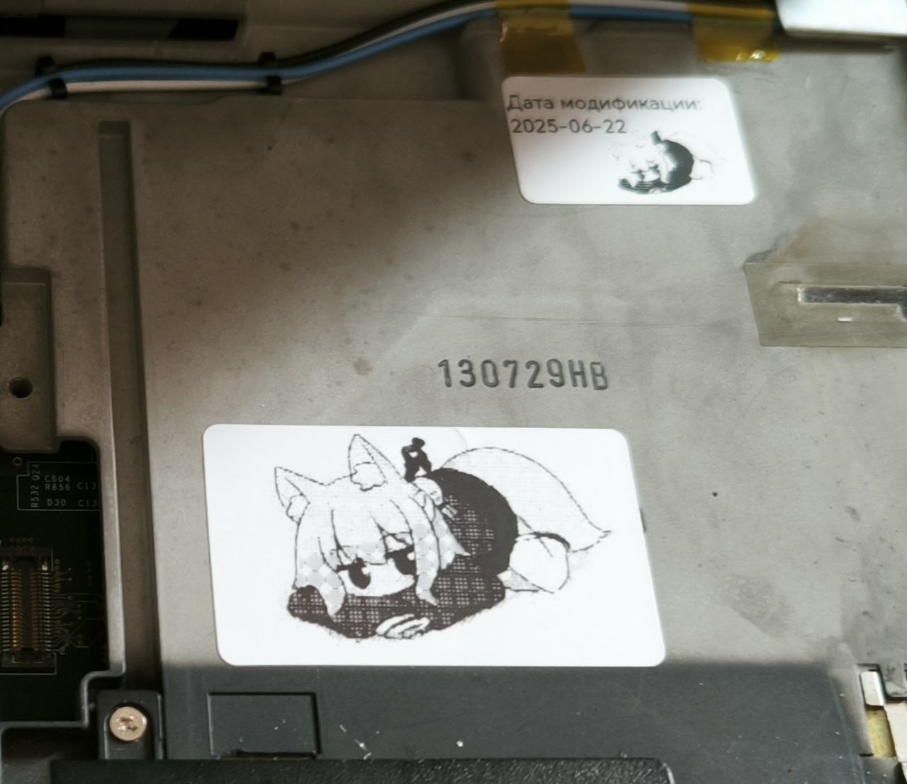

# img-conv4therm.print

A simple bash script to convert images into grayscale, dithered versions suitable for thermal printers.

## Features
- Optional width resizing while preserving aspect ratio
- Ordered dithering for clean thermal printing
- Keeps original resolution if width is not specified


## Dependencies
- [ImageMagick](https://imagemagick.org/) (tested with version 7+)

## Usage


```bash
./thermal_convert.sh <input_file> <output_file> [width]

